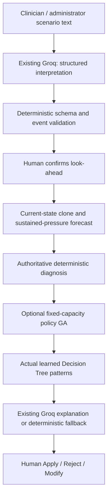

# Natural-language scenarios and V3 lock validation

This is an operational hospital simulation prototype, not an EHR integration, clinical advice or a validated medical protocol. The RF threshold remains 0.50. Sustained-pressure acceptance, fixed physical capacity, live ownership/lifecycle, six-gene GA/fitness, diagnosis, XAI, canonical hashing and human approval are unchanged.

## Scenario architecture

**Describe a Hospital Scenario** is the primary simple interface. `live_scenario_interpreter.py` uses the existing `llm_explanation.Groq` and `DEFAULT_MODEL` (`openai/gpt-oss-120b`), including existing `.env` loading with process-environment precedence. This is a separate interpretation purpose using the same provider/model infrastructure, not another verdict/explanation system.

Interpret Scenario only calls Groq and deterministically validates the returned event proposals. It does not modify the live clock, event queue, RNG, patients, resources or operating policy, run look-ahead/GA, or decide a handling verdict. Successful interpretation shows editable text, proposed events, assumptions and warnings. The user separately confirms **Run Look-Ahead**; **Apply Scenario Events** is another explicit action. **Edit Scenario** retains the text and clears the interpretation/forecast; **Cancel** clears the interpretation/forecast without changing hospital state.



## Exact parser output schema

All shown keys are required; unknown keys are rejected. Irrelevant or unspecified values use JSON null, not fabricated numbers:

```json
{
  "events": [
    {
      "event_type": "PATIENT_SURGE",
      "duration_minutes": 20,
      "start_delay_minutes": 0,
      "parameters": {
        "count": 35,
        "arrival_rate": null,
        "high_risk_proportion": 0.4
      }
    },
    {
      "event_type": "NURSE_SHORTAGE",
      "duration_minutes": 60,
      "start_delay_minutes": 0,
      "parameters": {
        "count": 15,
        "arrival_rate": null,
        "high_risk_proportion": null
      }
    }
  ],
  "assumptions": [],
  "warnings": [],
  "clarification": null
}
```

Supported event types are exactly PATIENT_SURGE, ARRIVAL_RATE_SPIKE, DOCTOR_SHORTAGE, NURSE_SHORTAGE, ICU_BED_OUTAGE and GENERAL_BED_OUTAGE. Count/proportion apply only to surges; arrival_rate only to spikes; count only to outages/shortages. Normalized proposals use the existing `LiveEvent.parameters` names with null entries removed.

### Scenario validation regression fix

The exact UI example `A bus accident sends 40 patients over 20 minutes` was reproduced with one real Groq request. The original schema permitted irrelevant non-null parameters. Groq returned this sanitized synthetic-scenario JSON:

```json
{
  "events": [{
    "event_type": "PATIENT_SURGE",
    "duration_minutes": 20,
    "start_delay_minutes": null,
    "parameters": {"count": 40, "arrival_rate": 120, "high_risk_proportion": null}
  }],
  "assumptions": ["Derived arrival_rate as 120 patients per hour from 40 patients over 20 minutes."],
  "warnings": [],
  "clarification": null
}
```

The event validator correctly rejected the invented `arrival_rate`; this was not a null-placeholder rejection. The corrected provider schema uses six event-specific `anyOf` variants: irrelevant parameter fields accept only JSON null. The prompt explicitly forbids deriving a surge arrival rate. Deterministic normalization removes null placeholders before event-specific validation; non-null irrelevant values, including zero, still fail. The UI retains the precise reason in **Scenario Interpretation Details** and the bounded interpretation audit.

The expected raw surge record has `count: 40`, `arrival_rate: null`, `high_risk_proportion: null`, duration 20 and delay 0 (or null, disclosed as current-time start). Its existing `LiveEvent` representation has `event_type: PATIENT_SURGE`, `duration_minutes: 20.0`, `created_sim_time` equal to the current clock, `start_sim_time` equal to that same clock, and `parameters: {"count": 40}`. Normal RF-profile risk distribution and current-time start are disclosed assumptions.

The five exact documented examples are regression-tested through raw provider JSON, the actual Streamlit input/button path and preview. The bus example also executes clone-only look-ahead, Edit and Cancel without modifying live state. The compound example requests clarification for the unspecified doctor-shortage duration. A separate UI test reproduces the observed invalid provider payload and checks the precise technical error. Only one real provider request was made, before the correction, to capture the failure; the corrected schema/preview path was validated locally with exact provider-shaped responses rather than a second provider request.

Limits and validation:

* Text 1–4000 characters; 1–6 proposed events; at most 12 assumption/warning strings of at most 500 characters each. Ambiguous requests return no proposal and a bounded clarification message.
* Strict numeric types; booleans, negatives, non-finite numbers and unsupported parameters are rejected. Counts are integers **at least one**, matching the manual builder; zero is not silently converted into an event. Surge count maximum is 1000.
* Durations at most 1440 minutes. Temporary events require positive duration. Only explicitly immediate surges may use zero, matching the existing Immediate Surge control.
* Delays are 0–480 simulated minutes, measured from interpretation time. Every proposed event must start within the chosen forecast horizon before prediction can run.
* Missing surge duration uses a disclosed 20-minute arrival-window assumption. Missing shortage/outage/spike duration requires clarification. Missing delay is disclosed as current-time start. No implicit resource magnitude is supplied.
* Missing high-risk share uses the ordinary cached RF-profile distribution. An explicit share must be in [0,1], and existing high/low profile subsets must support it. Profiles are sampled through the existing event engine; probabilities/features and threshold are unchanged.
* Existing physical-capacity and overlapping-outage rules run on an independent clone. Previously reserved/temporarily unavailable capacity is respected. Busy resources may become pending unavailable according to existing safe-release rules; patients are never evicted.
* Invalid input is rejected for edit/retry; nothing is clamped or silently reordered into another clinical meaning. No regex fallback interprets arbitrary scenario language.

Groq errors or missing credentials display **Natural-language interpretation is unavailable. Use Manual Event Builder.** Invalid/malformed output displays a nonfatal validation error. The collapsed **Advanced / Manual Event Builder** remains available with the same controls, presets, predictions and explicit application.

LLM text interpretation is not guaranteed semantically perfect. The user must check the structured event values and assumptions before confirming; deterministic validation cannot prove that arbitrary language was translated faithfully.

## Compound events and stale protection

`live_event_context.ScenarioEvents` is only a context wrapper over existing event entities, not a new stress-event type. Each member receives a distinct synthetic EVT ID without incrementing the live counter during interpretation. Offsets are preserved. Zero-offset members share the same start time. At a shared timestamp, availability changes are registered before surge arrivals; each member still follows the existing scheduler, assignment and safe-outage behavior.

Compound application performs full clone preflight, then applies the members through existing `apply_event`. Invalid combinations apply nothing; unexpected execution errors restore an in-memory checkpoint. No checkpoint is written to disk. Existing single-event call paths remain supported.

Look-ahead/GA still clone the current state and use existing common future seeds. Compound event metrics aggregate only their actual member patients, with wait means weighted by appropriate arrived/high-risk counts. Recovery is checked for every member; temporary policies retain all member IDs and restore only after their recovery. Physical totals remain fixed.

Provenance retains the primary event specification plus `related_events` specifications. Original text, normalized values, assumptions and state hash have a canonical interpretation checksum. Changed text, live state, targets, forecast settings or GA configuration make old output stale. Applying scenario events routes Adaptive Optimization Context to the entire applied scenario, not just one constituent.

After a policy change at the same clock/counter, **Revalidate Unchanged Scenario** can deterministically recheck identical event values without another AI call. It clears the old forecast and requires fresh look-ahead. It does not shift event times or treat old predictions as current. Once time, event IDs or text changes, interpretation must be repeated.

## Presentation and audit

The main adaptive view emphasizes scenario/verdict, current-to-optimized robustness, primary reason, actual policy changes, physical capacity unchanged, a 3–6 sentence explanation and human Apply/Reject/Modify buttons. The same explanation location shows Groq-grounded output when available or deterministic fallback when not. There is no duplicate main AI/fallback prose.

Raw comparison tables, replicated pressure, GA search details, learned Decision Tree paths/accuracy/class distribution and provenance are in expanders. A short XAI line names actual learned policy features and classification; it never claims those features caused the authoritative verdict. Single-class training reports explanation unavailable rather than inventing insight. Detailed explanation retains all verified failure evidence.

Session audit is capped at 200 compact primitive entries. It records original text and validated proposals/assumptions/outcome; look-ahead execution; GA recommendation; human apply/reject/modify; actual applied policy/events; cancellation, edits and revalidation. It stores no API keys, full prompts, raw provider responses or checkpoints, and writes nothing on ordinary refresh. Reset clears pending scenario/session artifacts while preserving existing physical-input reset behavior. Existing live events and policy histories remain separately bounded.

## Final validation

`tests/test_live_scenarios.py` uses mocked strict Groq output to test all supported text categories, compound offsets, required/unknown fields, negatives/booleans/fractions/capacity, disclosed defaults/clarification, provider failure, no-key manual fallback, no pre-confirmation mutation, cancel/edit/preview/application, atomic overlaps, event-specific metrics, compound GA/XAI/LLM provenance, temporary recovery, canonical stale checks and bounded audits. The preceding V2/V3 tests remain available.

Final full suite: **152 tests passed**, including all preceding 140 tests and 12 new scenario/workflow tests. The final run took about 24 seconds while A–G validation ran concurrently. It includes the full AppTest compound Interpret/Look-Ahead/GA/Reject/Retry/temporary Apply/revalidate/event Apply/recovery path, with only one mocked interpreter request.

`tests/validate_v3_lock.py` uses real cached RF profiles at **220 ICU / 550 General / 80 doctors / 140 nurses, 4/hour**, seed 42, after 12 simulated hours. Provider translations are mocked; the simulator, GA and verification are real. Search uses population 4, generations 2, search replication 1 and full verification 5.

| Case | Result |
|---|---|
| A: normal operation | HANDLED, 100% robustness |
| B: 12-patient surge over 20 minutes | HANDLED, 100%; original state/RNG unchanged |
| C: policy-limited compound event | 0% → 100%; CANNOT HANDLE → HANDLED; mean wait 23.52 → 17.88 minutes |
| D: larger compound event | 0% → 20%; CANNOT HANDLE → AT RISK; mean wait 25.92 → 20.45 minutes; partial policy retained |
| E: reject | No policy/state mutation; actual rejection UI also tested with AppTest |
| F: explicit temporary apply | Owners/totals preserved; 34 actual surge patients; restores after both events recover |
| G: Low random mode, seven days | 24 events, 792 cumulative arrivals, 251 active; live log capped at 1000; ownership/queue/accounting invariants pass |

For C/D, a **deliberately restrictive, human-entered process policy** uses nurse reserve 25% and wait-aging zero. This is not a changed physical baseline or claim that the ordinary default policy fails. The scenarios explicitly request lower-risk RF-profile sampling, 34/35 patients over 20 minutes and 90 nurses unavailable for 120 minutes. GA reduces nurse reserve to 21%; no bed/staff totals are optimized. These are demonstration results, not clinical validation.

Compact evidence: `results/live_twin/v3_lock_validation.json`. A–G runs in approximately 5.5 seconds, including about 2.2 seconds per small GA; seven-day advancement takes approximately 0.23 seconds. Interpreter calls use a 20-second timeout and no automatic retries; no live Groq network success is claimed. Reusing cached data/models prevents per-run RF reloads. Native browser validation launches `python main.py`, exercises the collapsed manual builder and existing human application/playback workflow, and creates no screenshots or large browser artifacts in the repo.

Repository growth is limited to source, tests, this document and a compact JSON summary. No data/model copies, giant scenario histories or checkpoints are created.

New source/tests/documentation/evidence total approximately 58 KiB, plus small edits and refreshed existing browser evidence. No screenshots or dataset/model artifacts were added.
